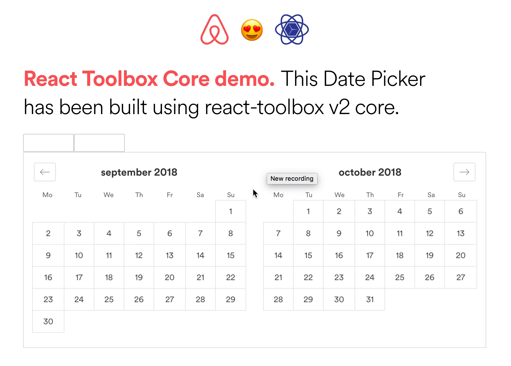

import nightOwl from 'prism-react-renderer/themes/nightOwl'
import { CodeSurfer as Code } from 'mdx-deck-code-surfer'
import { BackgroundImage, Counter, SpinLogo } from './components'
export { default as theme } from './components/theme'

<BackgroundImage src={require("file-loader!./images/first-slide.jpeg")} />

---

<BackgroundImage src={require("file-loader!./images/second-slide.jpeg")} />

---

<BackgroundImage src={require("file-loader!./images/lambda.jpg")} />

---

# (λx.x)(λy.y)

---

---

# `(x=>x)(y=>y)`

---

<BackgroundImage src={require("file-loader!./images/arrows.jpg")} />

---

<BackgroundImage src={require("file-loader!./images/toystory.jpg")} />

---

<SpinLogo src={require("file-loader!./images/react-logo.svg")}/>

## So... they say React is FUNCTIONAL

---

## ...but then...

---

## WHY ALL THOSE `class` AND `extends`? 🤔🤮😩

---

## Let's refactor Airbnb's calendar! 📅

---

---

<Code
  title='before...'
  theme={nightOwl}
  code={require('!raw-loader!./components/datepicker.js')}
  steps={[
    { lines: [6], notes: 'Pretty standard React code... 🙄' },
    { range: [5, 11], notes: 'Good ol\' state 🍷' },
  ]}
/>

---

> Welcome to `recompose`! 🤓🖖🏼

---

<Code
  title='...after!'
  theme={nightOwl}
  code={require('!raw-loader!./components/recompose.js')}
  steps={[
    { range: [5, 9] },
    { lines: [14], notes: 'What is this magic? ✨' },
    { tokens: { 14: [3] }, notes: 'withState API: 1st arg (state)' },
    { tokens: { 14: [6] }, notes: 'withState API: 2nd arg (handler)' },
    { tokens: { 14: [9] }, notes: 'withState API: 3rd arg (defaultValue)' },
  ]}
/>

---

## Let's see if this thing still works...

---

---

# It does! 🎉🎉🎉

---

## Now another quick example...

---

# Maybe Better Reducers 🤔

---

<Code
  title='folktale/maybe 🌈🦄'
  theme={nightOwl}
  code={require('!raw-loader!./components/maybe.js')}
  steps={[
    { lines: [1], notes: 'This is where Fantasy Land comes in 🎡' },
    { range: [3, 5], notes: 'actions ⚙️' },
    { lines: [7], notes: 'handlers 👋' },
    { range: [9, 13], notes: 'our *only* reducer 😎' },
    { range: [15, 19], notes: 'it works! 👏' },
  ]}
/>

---

<Code
  title='crocks 🐊'
  theme={nightOwl}
  code={require('!raw-loader!./components/crocks.js')}
  steps={[
    { lines: [1], notes: 'You might want to give crocks a try 😉' },
    { range: [3, 5], notes: 'same actions ⚙️' },
    { lines: [7], notes: 'same handlers 👋' },
    { range: [9, 11], notes: 'safe() returns a Maybe 🤔' },
    { range: [13, 17], notes: 'this also works! 👏🏼' },
  ]}
/>

---

### Does that _actually_ work???

<Counter />

---

# THANKS! ☺️

---

<BackgroundImage src={require("file-loader!./images/ending.png")} />
